# HomeDashboard

Nadzorna plošča za uporavljanje naprav in spremljanje stanja v hiši.

## [WiFi SonOff termostat TH16 + Senzor](https://www.wlan-sat.com/wifi-sonoff-termostat-th16-senzor)

- Upravljanje preko omrežja (Wi-Fi)
- Vgrajeno stikalo
- Senzor za temperaturo in vlago
- Temelji na ESP32

## [ESPTool](https://github.com/espressif/esptool?tab=readme-ov-file)

ESPTool je odprtokodno orodje za komunikacijo z ESP čipi preko USB povezave. Gre za ukaznovrstično orodje, napisano v Pythonu.

- Redno vzdževano
- Pridobivanje informacij o napravi
- Brisanje in zapis flash pomnilnika

### erase flash

### write flash

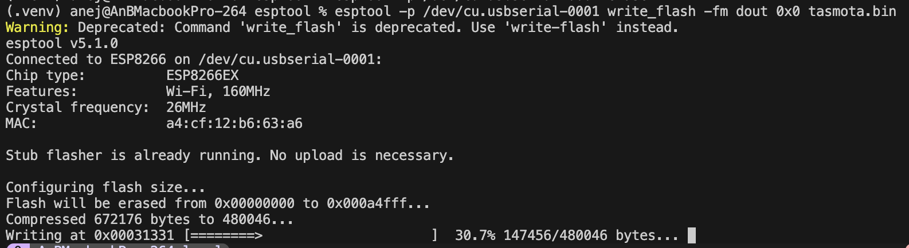

## [Tasmota](https://github.com/arendst/Tasmota/tree/development)
Tasmota je odprtokodni firmware za pametne IoT naprave (ESP8266/ESP32), ki omogoča lokalni nadzor in enostavno integracijo z domačo avtomatizacijo.

### Prednosti

- Odprtokodna
- Lokalno delovanje
- Vgrajen spletni vmesnik

### Slabosti

- Zahtevna namestitev
- Ni za vse naprave (samo ESP8266 / ESP32)

### Licenca

GPL-3.0 – odprtokodna licenca, ki zahteva objavo izpeljank pod isto licenco ter dostopnost izvorne kode.

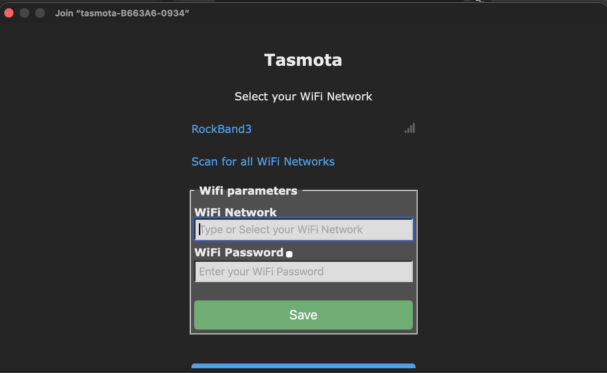
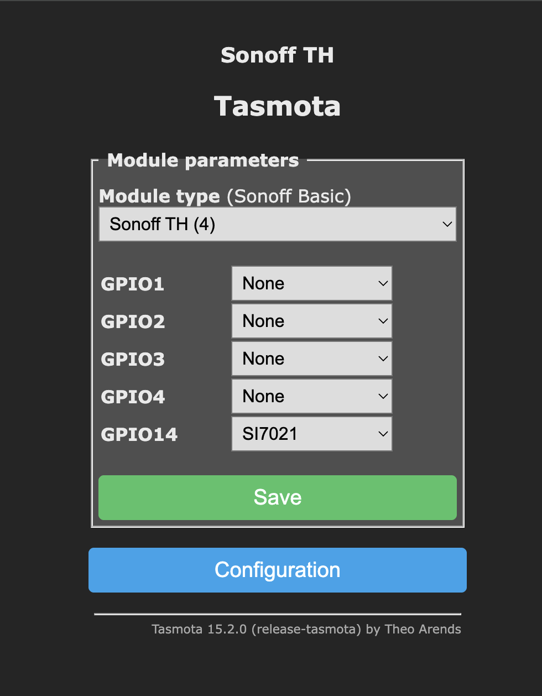
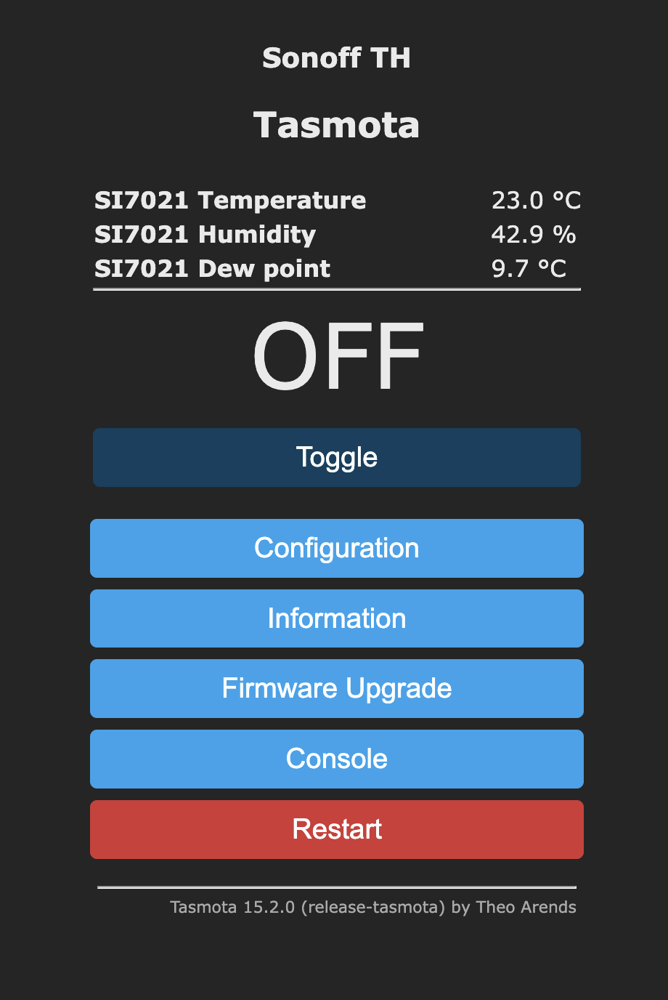

### MQTT
Lahek komunikacijski protokol, za pošiljanje sporočil med IoT napravami.

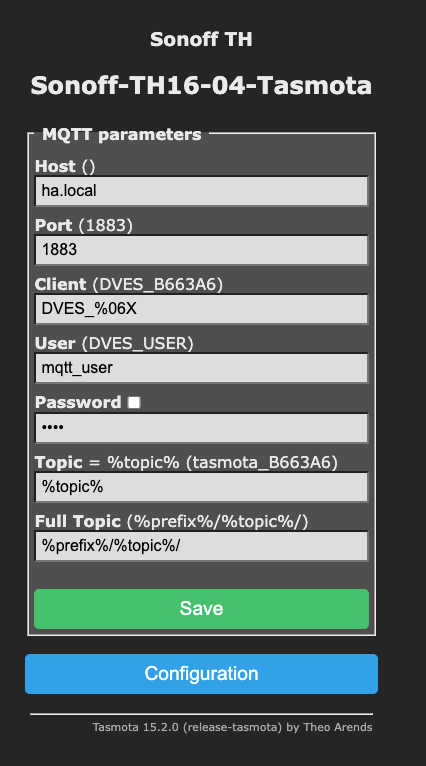

## [Home Assistant](https://github.com/home-assistant)

Home Assistant je odprtokodna platforma za avtomatizacijo pametnega doma. Omogoča povezovanje in uporavljanje različnih pametnih naprav iz enega mesta.

- Podpora za MQTT
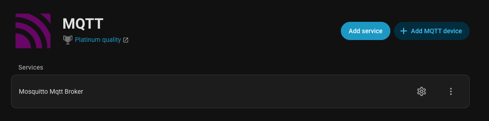
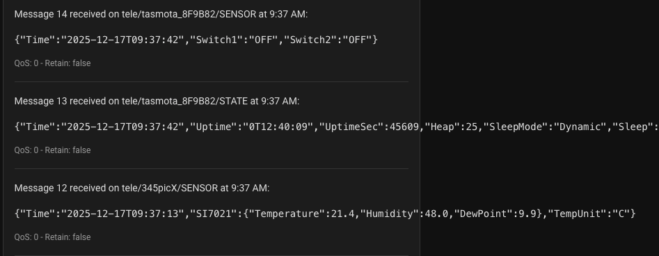
- Lokalno delovanje
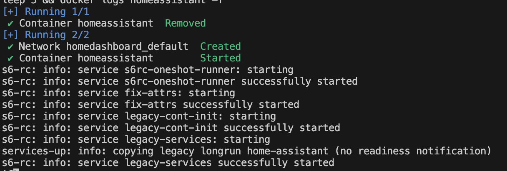
- Velika razširljivost
- Mobilna apliklacija

    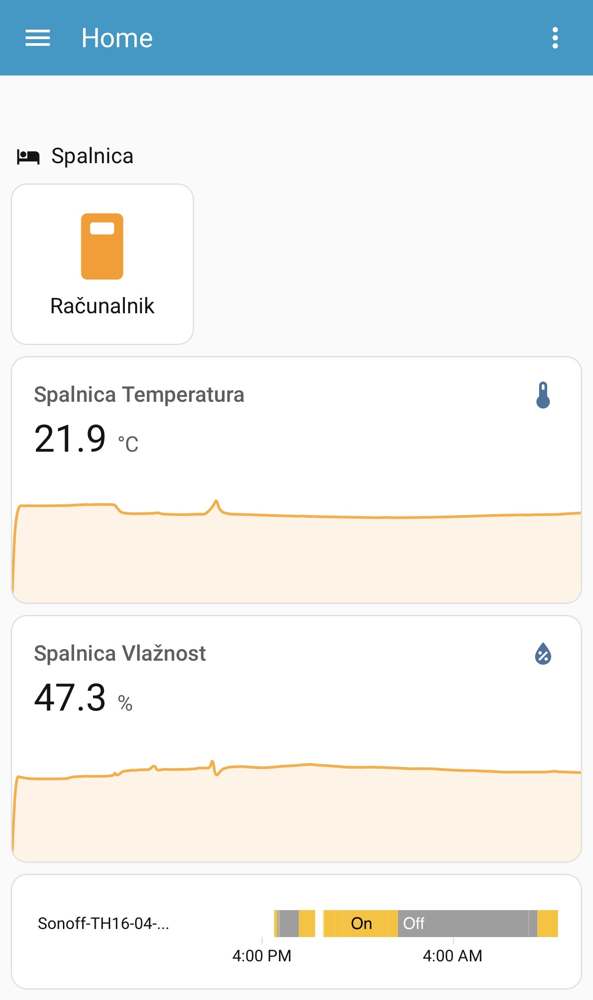

- Beleženje zgodovine
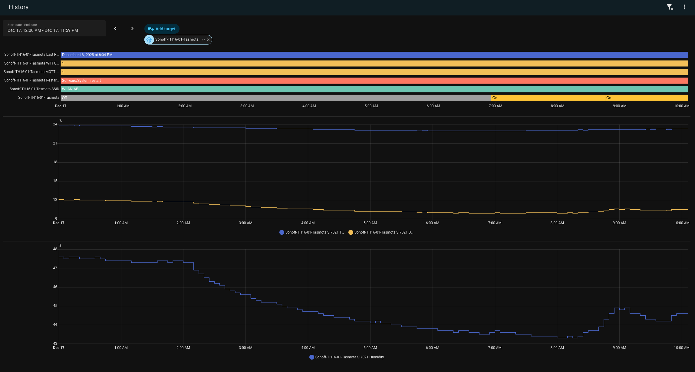

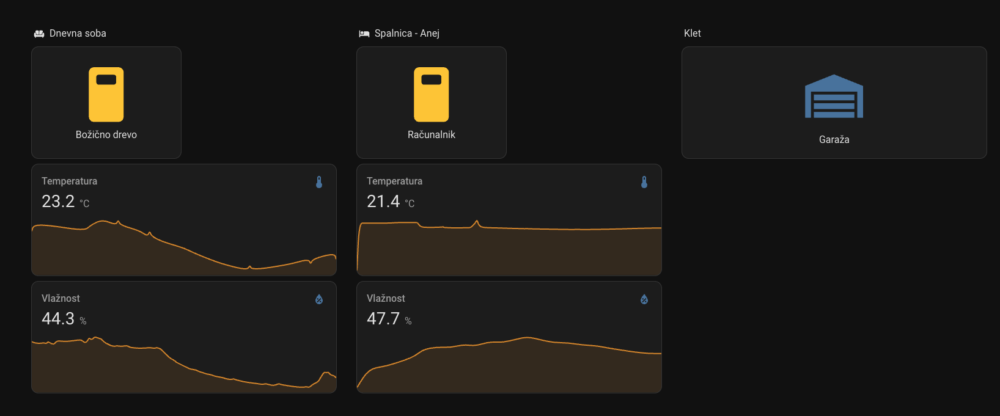